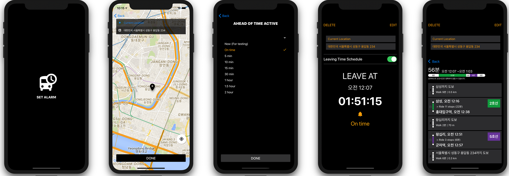

# The Last Subway

막차 정보와 푸시 알람기능을 제공하는 안드로이드, iOS 모바일 애플리케이션

- README English Version [[Link to Eng Version]](https://github.com/letsdoyi/the-last-subway/blob/master/README_Eng.md)




## 주요 특징

-	Google Directions API를 이용하여 목적지까지의 대중교통 경로 제공
-	Google Map, Geocode API를 이용하여 도착 위치 선택 기능
-	Expo Push Notifications, Android Channels를 이용한 푸시 알람 기능
-	목적지 위치, 푸시 알람 시간 수정 및 타이머 제거 기능
-	React Navigation API를 이용한 스크린 전환
-	Jest와 Enzyme을 사용한 Component, Reducer Unit  테스트
-	Git을 이용한 버전 관리

## 필요 조건
- 실제 디바이스가 필요합니다.
(Simulator 혹은 Emulator에서는 푸시 알림이 실행되지 않습니다.)

## 설치 전 필요한 선행 작업

- Google API에 들어갑니다. [Google API Console](https://console.developers.google.com/)


- 4개의 API를 활성화 시킵니다. [[how to link]](https://support.google.com/googleapi/answer/6158841?hl=en)

  * Maps SDK for Android
  * Maps SDK for iOS
  * Directions API
  * Geocoding API

- API key `<YOUR GOOGLE API KEY>`를 발급 받습니다.  [[how to link]](https://developers.google.com/maps/documentation/javascript/get-api-key)

## 설치

```
git clone https://github.com/letsdoyi/the-last-subway-client.git

cd the-last-subway-client

touch credentials.js

open credentials.js // Copy and paste the code below in this file

npm install

expo start

```

### `credentials.js`

이 파일에 아래 코드를 붙여넣습니다.

단, `<GOOGLE API KEY>`자리에 `<YOUR GOOGLE API KEY>` 를 넣습니다. [Prerequisites](#Prerequisites)

```
export default credentials = {
  GOOGLE : {
    APIKEY : <GOOGLE API KEY>
  }
}
```

## 사용한 기술

- JavaScript (ES2015+)

- Expo, React Native

- React for component-based-architechture

- React Navigation

- Redux for state management

- HTTP request using Axios

## 테스트

- Jest and Enzyme for Unit test

## 버전 및 일정 관리

- Git, Github

- Trello for managing scheluled tasks

## 챌린지
- 리액트와 다른 구조 : 스크린, 리액트 네비게이션

리액트를 처음 사용해보았는 데, 리액트 네이티브와 리덕스를 연결하는 작업이 어려웠습니다. 리액트에서는 리덕스의 스토어를 앱 컨테이너에 연결하면 props과 states를 스토어에 전달합니다. 하지만 리액트 네이티브에서는 구조가 달랐습니다. 네비게이터에 의해 스크린들이 연결되어 있었기 때문에 props와 states를 전달하기 위해서는 다른 구조가 필요했습니다. 앱 컨테이너에서 states와 props를 리액트 네비게이터에 전달하여 스크린들과 리덕스를 연결할 수 있었습니다.

- 2주 동안의 개발: 일정 관리와 대안 찾기

짧은 기간동안 프로젝트를 완성해야했기 때문에 개발일정을 관리하는 것이 어려웠습니다. 예상하지 못했던 문제들이 일어났을 때 어떻게 일정을 조절하고 개발을 해 나가야 하는지에 대해 배우게 되었습니다.

예를 들어, 목적지를 검색하기 위해 React Native Google Place Autocomplete 사용하려고 하였지만, 한국 지역으로 설정할 경우 작동하지 않는 문제를 발견하였습니다. 에러를 해결하려고 노력했지만 짧은 기간동안 충분히 시간을 쓸 수 없다고 판단하여 마커를 움직여 목적지를 설정하는 방식으로 변경하였습니다. 또한 일정은 그대로 진행하되, Google Place Autocomplete 문제해결의 우선순위를 옮겨 일정을 맞출 수 있었습니다.

또 다른 예는 public data portal open API (realtime station arrival API 관한 것 입니다. 정확한 막차 시간과 정보를 전달하기 위해 공공 API를 사용하려고 했으나 일시적으로 정보를 가져올 수 없는 문제가 있어 Google Direction API로 변경하여 사용했고 마감시간을 맞출 수 있었습니다.

이러한 경험을 통해서 일정을 관리하는 법을 배우게 되었고, 다양한 각도의 대안에 대해서도 생각해보는 시간을 가졌습니다.

## 개선 및 추가할 사항들

- [ ] Adding Place Autocomplete for improved location search

- [ ] Managing user's favorite locations

- [ ] Adding arrival time setting for providing accurate information

- [ ] Not stopping timer after leaving time BugFix

- [ ] Refactoring for code reusability

- [ ] End To End Test
